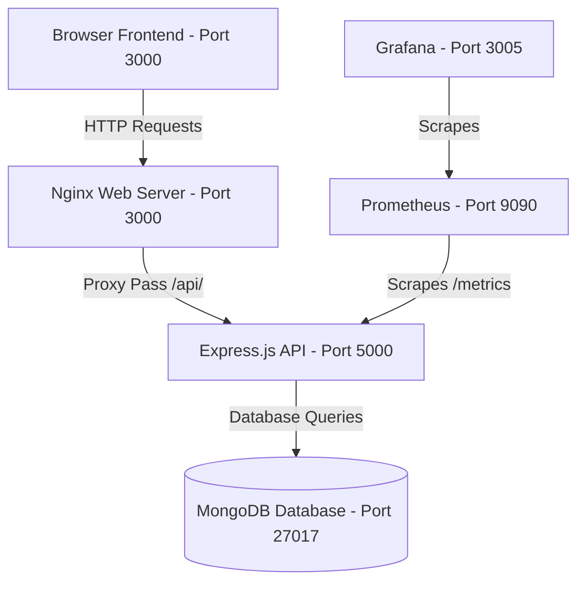

# Premium MERN E-Commerce DevOps Project

Welcome to the **MERN E-Commerce DevOps Project** (LuxeShop). This project implements a high-performance e-commerce catalog application featuring a premium modern dark-themed glassmorphism interface, coupled with an Express/MongoDB backend, automated containerization via Docker, orchestration on local Kubernetes (Minikube), Infrastructure as Code (IaC) via Terraform, and metric monitoring with Prometheus and Grafana.

---

## 🏗️ Architecture Overview

The system architecture consists of five core service tiers:



1. **Frontend**: Pure HTML5, JavaScript (ES6+), and Vanilla CSS static files, styled with glassmorphism and the Google Outfit font, served using **Nginx** (listening on port 3000). It features event delegation, local storage shopping cart synchronization, dynamic product updates, and interactive notifications.
2. **Backend**: A **Node.js/Express.js** web api exposing authentication endpoints (JWT validation, bcrypt password hashing) and product query APIs, exposing prometheus metrics aggregator under `/metrics` and running health checks under `/health`.
3. **Database**: **MongoDB** instance serving persistent product catalogs and user profile stores.
4. **CI/CD**: **Jenkins Pipeline** executing AWS CLI authentication, Terraform applies, and ECR container image pushes.
5. **IaC**: **Terraform** provisioning AWS ECR (Elastic Container Registry) repositories for application artifact distribution.
6. **Monitoring**: **Prometheus** scraper pulling API usage statistics from the backend, feeding data to **Grafana** dashboards.

---

## 📂 Project Structure

```
├── backend/
│   ├── controllers/      # Database query and JWT route logic
│   ├── models/           # Mongoose schemas (User, Product)
│   ├── routes/           # Routing middleware
│   ├── Dockerfile        # Node.js alpine execution script
│   ├── package.json      # Backend node modules
│   └── server.js         # Entry point, database connections, prometheus metrics
├── frontend/
│   ├── index.html        # Catalog page UI
│   ├── login.html        # Authentication Login interface
│   ├── signup.html       # Authentication Registration interface
│   ├── styles.css        # Responsive, custom HSL glassmorphism style rules
│   ├── script.js         # API integration, cart management, notification script
│   ├── Dockerfile        # Nginx alpine static files builder
│   └── nginx.conf        # Proxy pass rule and static assets server config
├── k8s/                  # Kubernetes deployment manifests
│   ├── backend-deployment.yaml
│   ├── backend-service.yaml
│   ├── frontend-deployment.yaml
│   ├── frontend-service.yaml
│   ├── mongo-deployment.yaml
│   └── mongo-service.yaml
├── monitoring/
│   └── prometheus.yml    # Scraper job configurations
├── terraform/            # IaC definitions for AWS ECR
│   ├── main.tf
│   ├── outputs.tf
│   ├── provider.tf
│   └── variables.tf
├── docker-compose.yml    # Development orchestration compose configuration
├── Jenkinsfile           # Windows CI/CD Pipeline pipeline execution
└── README.md             # Project documentation (this file)
```

---

## 🚀 Execution Guide

### 1. Local Run via Docker Compose

Spin up the entire stack (App, DB, Monitoring) with a single command:

```powershell
# Build and launch all services in background
docker-compose up -d --build

# Verify running containers
docker-compose ps
```

* **Frontend Access**: Navigate to [http://localhost:3000](http://localhost:3000)
* **Backend API**: Check server status at [http://localhost:5000/health](http://localhost:5000/health)
* **Prometheus Metrics**: Scrape details at [http://localhost:5000/metrics](http://localhost:5000/metrics)
* **Prometheus Dashboard**: Connect to [http://localhost:9090](http://localhost:9090)
* **Grafana Dashboard**: Monitor system health at [http://localhost:3005](http://localhost:3005) (Default credentials: `admin` / `admin`)

To shut down and wipe container state:
```powershell
docker-compose down -v
```

---

### 2. Local Kubernetes Deployment (Minikube)

Follow these instructions to run the application in a local Kubernetes cluster:

#### Step 2.1: Start Minikube
```powershell
minikube start --driver=docker
```

#### Step 2.2: Configure Shell to use Minikube's Docker Daemon
Expose the local Minikube docker environment to build the images inside the cluster context:
```powershell
# For Windows PowerShell
minikube docker-env | Invoke-Expression
```

#### Step 2.3: Build Local Docker Images inside Minikube
```powershell
docker build -t ecommerce-frontend:latest ./frontend
docker build -t ecommerce-backend:latest ./backend
```

#### Step 2.4: Deploy Manifests
Deploy the MongoDB, backend API, and static frontend deployments and services:
```powershell
kubectl apply -f k8s/
```

#### Step 2.5: Verify Pods and Services
```powershell
kubectl get pods
kubectl get service
```
Wait until all pods show `Running` and readiness checks pass.

#### Step 2.6: Access the Application
The frontend is configured as a `NodePort` service mapping to port `30007`. Fetch the direct URL using:
```powershell
minikube service frontend-service --url
# Or open it directly in your browser:
minikube service frontend-service
```

To clean up resources:
```powershell
kubectl delete -f k8s/
```

---

### 3. Provisioning AWS ECR with Terraform

Configure AWS ECR repositories for production release pipelines:

```powershell
# Initialize and validate configurations
cd terraform
terraform init
terraform validate

# View planned resources (ECR repos: ecommerce-frontend & ecommerce-backend)
terraform plan

# Apply changes to create repositories on AWS
terraform apply -auto-approve
```

---

### 4. Jenkins CI/CD Setup (Windows Agent)

A declarative `Jenkinsfile` is provided in the project root. It executes under Windows and automates resource creation and artifact publishing:

1. **Pipeline Triggers**: Triggered manually or via webhook commits.
2. **AWS Authentication**: Credentials must be defined in the Jenkins Credentials store using the ID `aws-credentials-id` (configure it as Username and Password containing the `AWS_ACCESS_KEY_ID` and `AWS_SECRET_ACCESS_KEY`).
3. **Pipeline Actions**:
   * **Stage 1 (Checkout)**: Retrieves code from version control.
   * **Stage 2 (Terraform Apply)**: Prepares the AWS target architecture, validating repositories.
   * **Stage 3 (Login)**: authenticates local docker engine to AWS ECR.
   * **Stage 4 (Build)**: Packages application artifacts into Docker images.
   * **Stage 5 (Push)**: Publishes packaged images under your AWS Registry ID.

---

## 📈 Monitoring Setup

1. **Prometheus Target Verification**: Log in to `http://localhost:9090/targets` to verify `ecommerce-backend` is showing state `UP`.
2. **Grafana Metric dashboard integration**:
   * Connect to Grafana at `http://localhost:3005` (user `admin` / pass `admin`).
   * Navigate to **Connections -> Data Sources**, click **Add data source**, and select **Prometheus**.
   * Set Prometheus Server URL to `http://prometheus:9090` (internal network DNS name) and click **Save & test**.
   * Build dashboards using exported metrics (e.g., `http_requests_total`).

echo "Webhook Test" >> test.txt